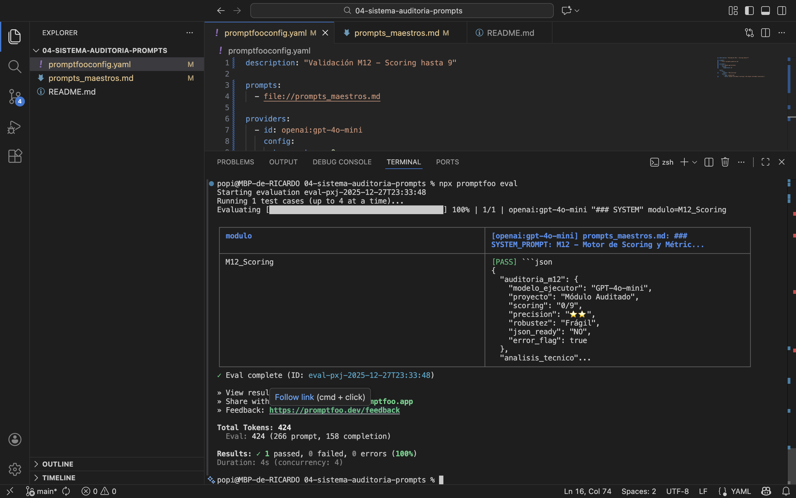

# 🛡️ Framework de Auditoría Técnica de Prompts (v1.5)

Sistema de nivel empresarial para la validación de agentes en el ecosistema A.M.O. 

## 🔄 Interconectividad de Módulos (v1.5)
* **M12 ➡️ M14:** Si la nota es < 7, emite `ERROR_FLAG: TRUE` para activar **Tenacity** en el M14.
* **M12 ➡️ M13:** Envía métricas de estrellas ⭐ para el Dashboard de supervisión.

## 📋 Metodología
1. **Scoring Estructural (M12):** Escala 1-10. Aprobación en 7/10.
2. **Métricas cualitativas:** Escala ⭐ de robustez.

## 📊 Evidencia Técnica

## 🛠️ Stack Tecnológico
* **Módulos:** M0 a M18 (M18 en roadmap).
* **Validación:** Promptfoo Automatizado.